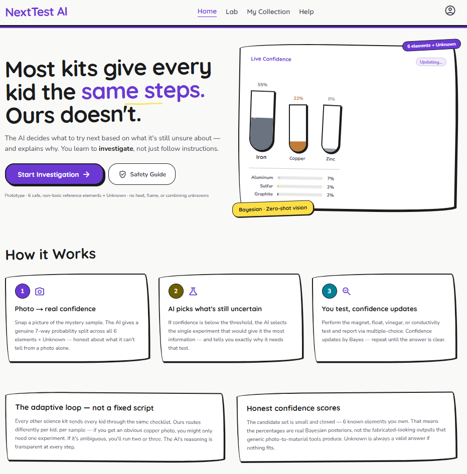
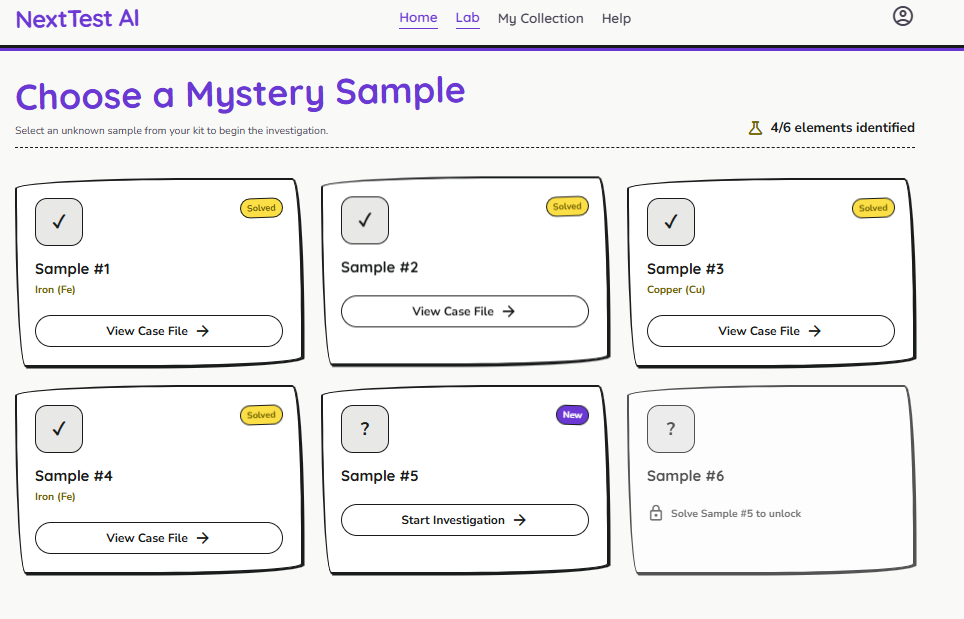
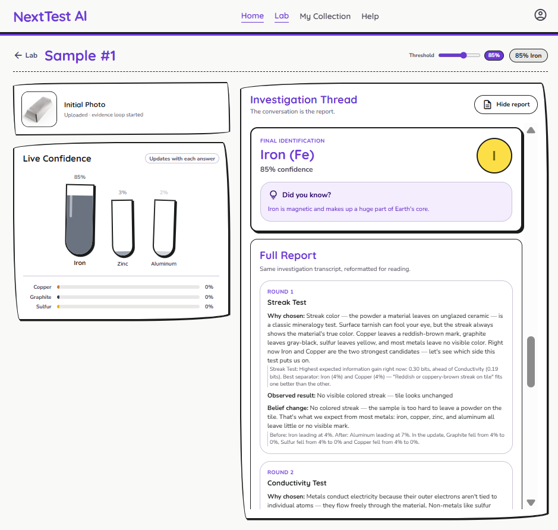
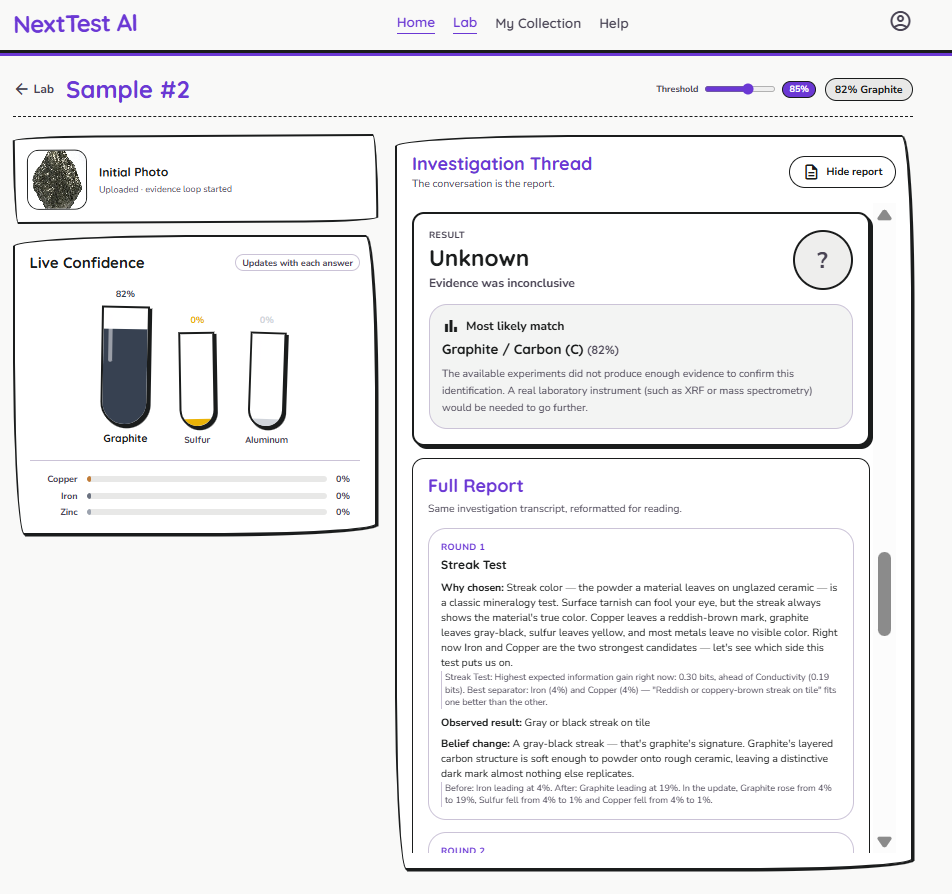

# NextTest AI — The Element Detective

**An Adaptive, AI-Guided STEM Learning Kit for Chemical Element Identification**

*Submitted for: HackTheStack (via Unstop)*  
*Team: Unpaid Interns*  
*September 2026*

## 1. Project Overview

### 1.1 Problem Statement
Conventional school-level chemistry kits rely on static, checklist-style instructions: a student follows a fixed sequence of experiments regardless of the sample in front of them, with no adaptive reasoning and no feedback on whether their conclusions are correct. This approach teaches procedure, not the scientific method — it does not require students to interpret evidence, weigh uncertainty, or decide what to test next.

NextTest AI addresses this gap by pairing a physical, hands-on chemistry kit with an AI system that reasons under uncertainty in real time, guiding each student through a personalised, evidence-driven investigation rather than a fixed script.

### 1.2 Proposed Solution
NextTest AI is a STEM education kit in which students are given six unidentified chemical element samples (iron, copper, zinc, aluminium, sulfur, and graphite) accompanied by a companion web application. 

The student photographs a sample, and a vision-capable AI model produces an initial probability distribution across the six known elements and an "Unknown" category. A deterministic Bayesian inference engine then selects the single physical experiment that yields the highest expected information gain, the student performs it and reports the observation, and the system updates its confidence accordingly. This observe–test–update loop repeats until the model reaches a target confidence threshold or exhausts the available experiments, at which point it returns either a confirmed identification or an honest "Unknown" verdict.

The result is an experience in which the AI does not simply hand the student an answer — it teaches the underlying logic of evidence-based reasoning by making its own uncertainty and decision-making visible at every step.

### 1.3 Innovation & Differentiation
*   **Adaptive, not scripted:** the system uses genuine Bayesian probability updates rather than a hard-coded decision tree, so the identification path adapts to each sample and each student's results.
*   **Genuine uncertainty modelling:** initial AI confidence is deliberately capped, and experiments are chosen by expected information gain rather than a fixed order, so no two investigations play out identically.
*   **Honest about its limits:** the system is built to say "Unknown" when the evidence does not support a conclusion, rather than force a guess — a deliberate design choice that models intellectual honesty for students.
*   **Hardware and software fused:** a physical kit, a self-hosted AI backend, and a modern web frontend are combined into a single coherent product, rather than a purely digital or purely physical exercise.

### 1.4 Technology Stack
*   **Frontend:** Next.js, React (server and client components), TypeScript, Tailwind CSS, Framer Motion
*   **AI Infrastructure:** Self-hosted Ollama inference server on Oracle Cloud (ARM, CPU-only instance)
*   **Models:** `qwen2.5vl:3b` (vision-based initial classification), `qwen2.5:3b` (student-facing natural-language explanations)
*   **Inference Logic:** A custom deterministic Bayesian engine (`bayes.ts`) computing Expected Information Gain (EIG) for experiment selection and probability revision
*   **State Management:** A dedicated React context (`LabContext` / `store.tsx`) tracking per-sample investigation trails, evidence history, and completion state
*   **Backend Exposure:** nginx reverse proxy exposing an OpenAI-compatible endpoint, secured via Bearer-token authentication

---

## 2. Team & Contributions

### 2.1 Team Name
**Unpaid_Interns**

### 2.2 Team Members & Roles
*   **Yajat Prabhakar** — Team Lead; software architecture and end-to-end development of the AI reasoning engine, backend infrastructure, and web application.
*   **Mandeep Singh** — Development; contributed to the build and testing of the web application and supporting systems.
*   **Khyati Sharma** — Presentation and communication of the project's concept, design, and impact.
*   **Khushi** — Presentation and communication of the project's concept, design, and impact.

*All core technical development — architecture, AI integration, Bayesian logic, infrastructure, and UI implementation — was carried out by Yajat Prabhakar, with Mandeep Singh contributing to development. Khyati Sharma and Khushi were responsible for shaping and delivering the project's presentation materials.*

---

## 3. Current Progress

The project has reached a stable, functionally complete state across its core architecture, AI reasoning engine, and user interface. The following sections summarise the current state of development.

### 3.1 Core Architecture & Foundation
*   **Application framework:** The application is structured on Next.js using modern React server and client components, styled with Tailwind CSS and animated with Framer Motion.
*   **State management:** A dedicated context (`LabContext`) manages the state of all six samples, tracking each sample's investigation trail, accumulated evidence, and completion status independently.
*   **Secure configuration:** Server-side configuration securely connects the application to the self-hosted Ollama backend, ensuring backend credentials are never exposed to the client.

### 3.2 AI & Bayesian Inference Engine
*   **Zero-shot vision classification:** A vision-capable model (`qwen2.5vl:3b`) analyses the initial photograph of a sample and returns a structured probability distribution across all six known elements plus an "Unknown" category.
*   **Student-facing explanation layer:** A separate text model (`qwen2.5:3b`) generates encouraging, non-mathematical explanations of why a given experiment was selected and what its result means, tailored for a student audience.
*   **Deterministic Bayesian logic:** A deterministic, non-AI Bayesian module computes Expected Information Gain (EIG) to select the next most informative experiment and updates the probability distribution based on each observed result — ensuring the reasoning behind every decision is transparent and reproducible.

### 3.3 User Interface & Experience

*   **Landing page:** An introductory page explaining the adaptive nature of the kit and how the investigation process works.
*   **Lab dashboard:** A progression tracker in which samples unlock sequentially as students complete each investigation.

*   **Active investigation interface:** The core workspace, presented as a split-pane interface: a camera/upload panel with a live "confidence tubes" visualisation on one side, and an interactive, chat-style investigation thread on the other, where the AI explains each step and the student records results.

*   **Final reports:** A dynamically generated summary of the full scientific process followed during a session, presented as a final report at the conclusion of each investigation. (The system correctly handles inconclusive evidence, as shown below.)

### 3.4 Recent Refinements & Robustness Fixes
A number of edge cases were identified and resolved to ensure the system behaves strictly as an educational tool, rather than allowing shortcuts that would undermine its pedagogical purpose.
*   **Enforced experimentation:** The initial AI classification is capped at a maximum of 75% confidence, with the surplus redistributed proportionally across remaining candidates. This ensures a student cannot reach a conclusive identification from a single photograph alone and must perform at least one physical experiment before crossing the confidence threshold.
*   **Accurate handling of inconclusive results:** A logic error that previously allowed the system to falsely confirm a top candidate after all experiments were exhausted has been corrected. The system now correctly reports "Unknown" when confidence targets are not met, presenting the most likely match without overstating certainty.
*   **Improved camera interface:** The camera interface has been refined to remove an obstructive overlay during active photo capture, replacing it with a minimal status indicator so students retain a clear, unobstructed view of the sample being photographed.

---

## 4. Challenges Faced
*   **Vision model reliability:** Achieving reliable, strictly-formatted probability outputs from a vision-language model (`qwen2.5vl:3b`) required careful prompt design, and initial model confidence needed deliberate calibration (see the 75% confidence cap) to preserve the kit's educational integrity.
*   **Self-hosted server infrastructure:** Provisioning a CPU-only Oracle Cloud ARM instance to run Ollama in production required configuring both cloud-level security list ingress rules and instance-level iptables rules, and exposing the service safely via an nginx reverse proxy with Bearer-token authentication rather than an open port.
*   **Persisting experiment findings:** Persisting each sample's investigation trail, evidence history, and running probability state across a multi-step, asynchronous experiment loop — without data loss or state corruption between steps — required a dedicated state-management layer rather than ad hoc component state.

---

## 5. Physical Kit Overview
Alongside the web application, NextTest AI includes a physical STEM kit designed to make the investigation tangible:
*   **Sample tray:** Six labelled compartments, each containing a mystery element sample and a QR code for later verification.
*   **Test materials tray:** A magnet, a vinegar bottle, a conductivity tester, and a scratch plate (file), corresponding to the physical experiments available to students.
*   **Getting Started guide:** A printed guide walking students through the Take a Photo → AI Analysis → Identify & Learn flow, with a QR code linking to the web application.

*(Note: The above kit is conceptual kit as we don’t have the raw materials for the kit yet)*

---

## 6. Future Scope & Roadmap
The following roadmap outlines planned directions for extending NextTest AI beyond its current submission state:
1.  **QR Confirmation Loop** — a QR code on each element's box or wrapper that students scan after identification to confirm whether the AI's guess was correct, closing the feedback loop between prediction and ground truth.
2.  **Guided Experiment Tutorials** — short, step-by-step tutorials (visual or video) for each physical experiment, helping students carry out tests correctly and consistently before reporting results back to the AI.
3.  **Personalisation Database** — persistent user profiles enabling personal customisation and configurable difficulty settings.
4.  **Difficulty-Adaptive Experiment Paths** — extending the difficulty setting so the Bayesian engine itself adapts, offering younger students more guided investigations with fewer required steps.
5.  **Expanded Element & Experiment Library** — broadening the kit beyond the initial six elements with additional samples and test types.
6.  **Post-Kit Open Exploration Mode** — once all six elements have been identified, allowing students to converse with the AI and experiment with common household items in a more open-ended manner. This is an early-stage, exploratory concept; the underlying mechanics are still being defined.
7.  **Multi-Language Explainer Support** — extending the AI's student-facing explanations beyond English into regional languages, to broaden classroom accessibility.
8.  **AI Model & Communication Optimisation** — continued refinement of inference speed, classification accuracy, and client–server communication efficiency.

---

## 7. Repository & Resources

*   **GitHub Repository:** [https://github.com/Yajat-prabhakar/NextTest-AI](https://github.com/Yajat-prabhakar/NextTest-AI)
    *The repository contains the complete source code for the web application, including the frontend interface, the Bayesian inference engine, and the server configuration used to connect to the self-hosted AI backend.*

*   **Video Explanation:** [Google Drive Link](https://drive.google.com/file/d/13XoV8_rDxO3baf8ACrkW83HD7v9nST3t/view?usp=sharing)
    *The Video Link explaining the project, its idea behind it using ai generated video by NotebookLM.* 
    *(Note: This Video is an explanation of the idea not the demo video of the project)*

*   **Demo Video:** [Google Drive Link](https://drive.google.com/file/d/1dlUHOwrWSWOX6iMr8yZ8kJB3Z7NRQxkl/view?usp=sharing)
    *The Demo video Demonstrating the project progress till now.* 
    *(Note: The video is also given in the zip folder with all the documents)*
